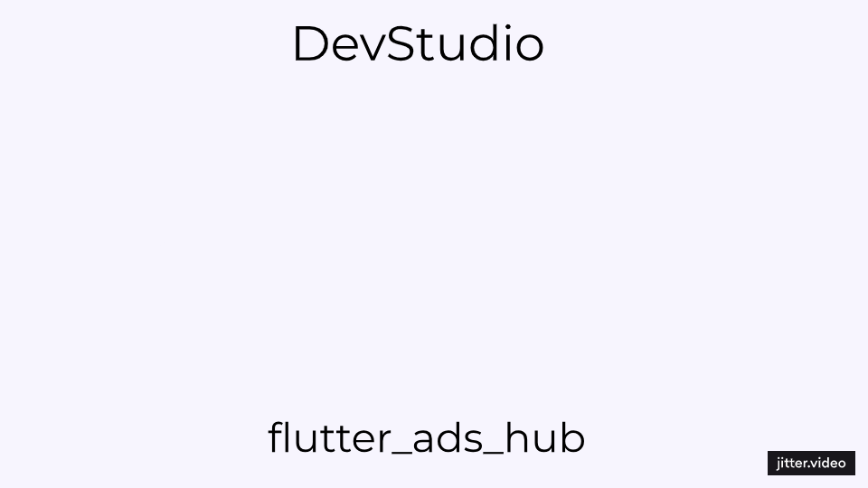

# 📱 Ad Integration Example using Flutter and GetX

This Flutter project demonstrates integrating Google AdMob and Facebook Audience Network using GetX for state management. 

## 🚀 Features

- **🔄 Adaptive Ad Switching**: Easily switch between Google Ads and Facebook Ads using a simple dropdown menu in the app.
- **📊 Multiple Ad Network Integration**: Integrates both Google AdMob and Facebook Audience Network.
- **🛠️ State Management with GetX**: Efficiently manages state using GetX for reactive programming and easy dependency injection.
- **⚠️ Error Handling**: Handles ad load failures and network errors gracefully, with retry mechanisms and fallback UI.
- **📐 Clean Architecture**: Separates business logic, services, and UI for maintainable and scalable code.

## 📽 Preview

## 🏗️ Project Structure

- `lib/`
  - `controllers/`
    - `ad_controller.dart`: Manages the ad loading and switching logic
  - `models/`
    - `ad_config.dart`: Data model for ad configuration
  - `services/`
    - `ad_service.dart`: Service to fetch ad configuration
  - `utils/`
    - `ad_utils.dart`: Utility functions for loading ads
  - `views/`
    - `main_view.dart`: Main view displaying ads
  - `main.dart`: Entry point of the application

## 📋 Usage

- The app initially loads the ad configuration and displays the respective ad (Google or Facebook) based on the current setting.
- Use the dropdown menu in the app bar to switch between Google Ads and Facebook Ads.
- The app handles ad load failures by displaying a fallback UI and retrying to load the ads up to a maximum number of retries.

## 💡 Contributing

Contributions are welcome! Please create an issue first to discuss what you would like to change.

## 📄 License

This project is licensed under the MIT License.

## 🙏 Acknowledgements

- [Flutter](https://flutter.dev/)
- [GetX](https://pub.dev/packages/get)
- [Google Mobile Ads SDK](https://pub.dev/packages/google_mobile_ads)
- [Facebook Audience Network SDK](https://pub.dev/packages/facebook_audience_network)

## About the Developer 🌟

**👨‍💻Mo'men M.** is passionate about creating efficient and user-friendly mobile applications. With expertise in Flutter and Firebase, Mo'men focuses on delivering robust solutions that enhance user experiences and meet business objectives.

- 🌐 Website: [mmdev.studio](https://mmdev.studio/)
- 💼 LinkedIn: [mm-devstudio](https://www.linkedin.com/in/mm-devstudio/)
- 📸 Instagram: [devstudio_mm](https://www.instagram.com/devstudio_mm/)
- 📝 Upwork: [Mo'men M. on Upwork](https://upwork.com/freelancers/mo2men184)
- 💻 Freelancer: [devmo2 on Freelancer](https://www.freelancer.com/u/devmo2)
- 📧 Email: [dev.moamen.sr@gmail.com](mailto:dev.moamen.sr@gmail.com)

